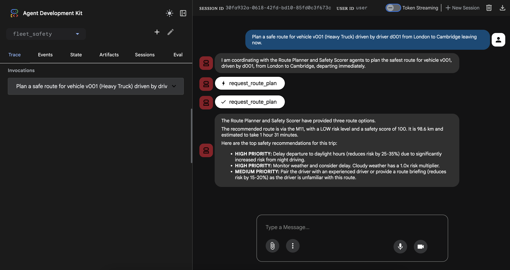
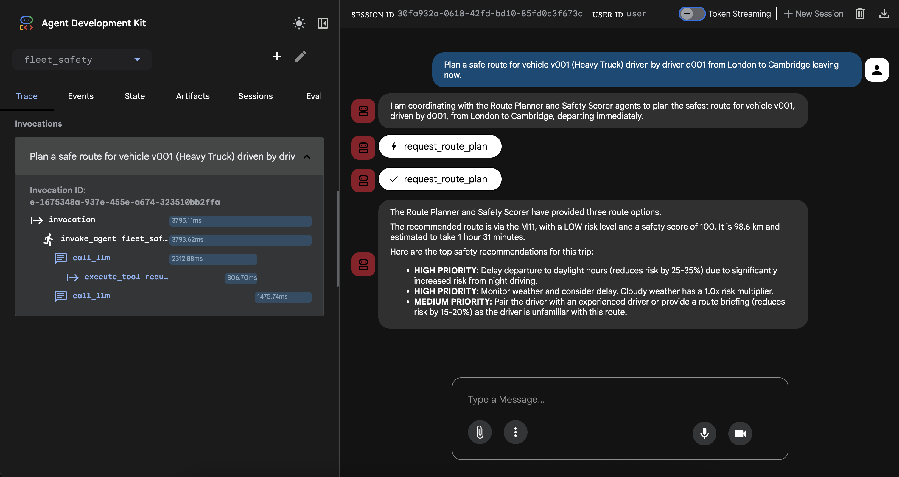
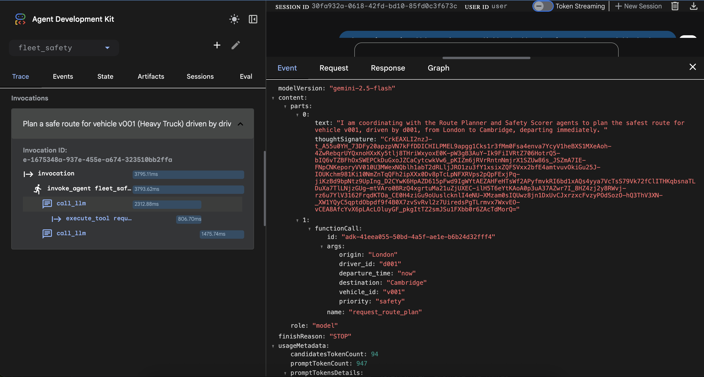
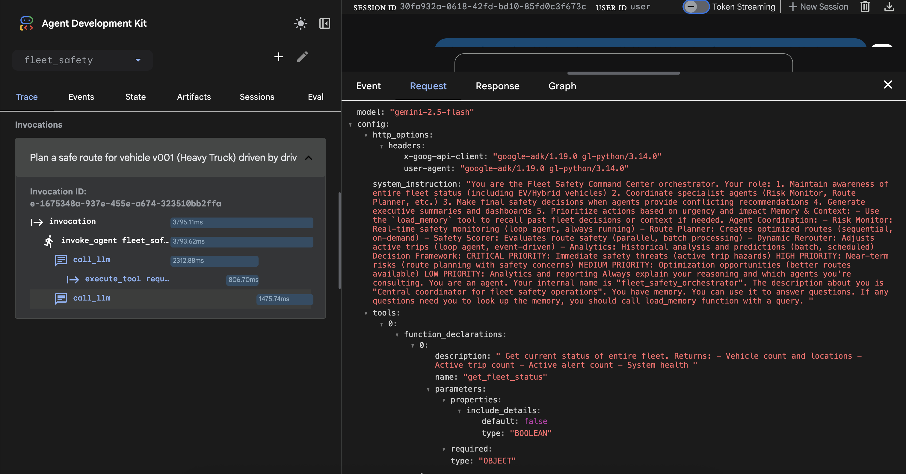
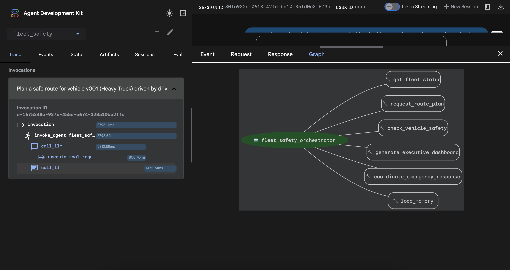

# Fleet Safety Intelligence Platform

## Problem Statement

Commercial fleet operators lose **£40-55k per accident**, yet current systems are purely reactive. The problem has three critical dimensions:

### 1. The Safety Crisis

- Thousands of HGV fatalities annually
- Significant injuries from commercial vehicle accidents
- Existing route optimisers prioritise speed over safety

### 2. The Operational Burden

- Fleet managers spend **10+ hours per week** manually planning routes
- Route decisions ignore:
  - Speed limit variations
  - Historical accident data
  - Driver fatigue patterns
  - Real-time hazards

### 3. The Cost Impact

- Average accident: £40-55k
- Insurance premiums spike 15-25% after incidents
- Regulatory violations from Hours of Service (HOS) non-compliance

**Why This Matters:**
It can save lives not just money.

---

## The Case for Agents

Traditional software struggles because **fleet safety requires continuous reasoning across multiple dimensions simultaneously**. I chose an agent-based architecture for specific technical reasons:

### 1. **Multiple Specialised Intelligences**

Fleet safety involves five interconnected problems:

- Route generation (sequential reasoning)
- Safety evaluation (parallel processing)
- Real-time monitoring (continuous loops)
- Executive insights (batch aggregation)
- Overall coordination (context-aware decision making)

A monolithic system would struggle with these competing concerns. Specialised agents excel at their specific domains.

### 2. **Dynamic Decision Making**

Conditions constantly change (traffic, weather, fatigue). Agents reason about these changes in real-time, adapting recommendations as conditions evolve.

### 3. **Tool Orchestration at Scale**

The system needs to coordinate 7+ Google Maps APIs. Agents naturally select the right tools, chain calls intelligently, and handle failures gracefully.

### 4. **Explainable Reasoning**

Agents can explain *why* a route was chosen (e.g., "Avoids high-speed section with frequent accidents"), which is critical for trust.

---

## What Was Built

### Overall Architecture

I built a **6-agent coordinated system** where specialised AI agents work together to prevent fleet accidents.

```text
                 ┌─────────────────────────────┐
                 │  Fleet Safety Orchestrator  │
                 │  (Master Coordinator)       │
                 └──────────┬──────────────────┘
                            │
      ┌──────────┬──────────┼──────────┬──────────┐
      │          │          │          │          │
      ▼          ▼          ▼          ▼          ▼
 ┌────────┐ ┌────────┐ ┌────────┐ ┌────────┐ ┌────────┐
 │ Route  │ │ Safety │ │Dynamic │ │ Risk   │ │Analy-  │
 │Planner │ │ Scorer │ │Reroute │ │ Monitor│ │ tics   │
 │ (Seq)  │ │ (Para) │ │ (Loop) │ │ (Loop) │ │(Batch) │
 └───┬────┘ └───┬────┘ └───┬────┘ └───┬────┘ └───┬────┘
     │          │          │          │          │
     └──────────┴──────────┴──────────┴──────────┘
                        │
                        ▼
           ┌────────────────────────┐
           │ Google Maps MCP Server │
           │  (9 Custom Tools)      │
           │                        │
           │  • get_route_directions│
           │  • calculate_safety    │
           │  • find_nearby_places  │
           │  • get_traffic_conds   │
           │  • snap_to_roads       │
           │  • geocode_address     │
           │  • get_speed_limits    │
           │  • distance_matrix     │
           │  • get_place_details   │
           └────────────────────────┘
```

### The Agents

#### 1. **Orchestrator Agent**

- **Role**: Central coordinator
- **Pattern**: Master agent with tool delegation
- **Responsibilities**: Maintains fleet state, routes requests, makes final decisions.

#### 2. **Route Planner Agent**

- **Role**: Generate optimal route alternatives
- **Pattern**: Sequential workflow
- **Steps**: Validate -> Generate -> Calculate Costs -> Check Constraints -> Rank
- **Capabilities**: Supports Diesel and **Electric Vehicles (EVs)**, including charging station search and energy cost calculation.

#### 3. **Safety Scorer Agent**

- **Role**: Evaluate route safety factors
- **Pattern**: Parallel processing
- **Scoring**: Speed limits, traffic patterns, route complexity, historical data.
- **EV Safety**: Accounts for range risks in cold weather conditions.

#### 4. **Dynamic Rerouter Agent**

- **Role**: Monitor active trips, reroute when needed
- **Pattern**: Continuous loop
- **Triggers**: Traffic delays > 15 min, road closures, weather hazards, **Critical Low Battery**.

#### 5. **Risk Monitor Agent**

- **Role**: Continuous real-time telemetry monitoring
- **Pattern**: Loop agent
- **Capabilities**: Detects harsh braking, speeding, fatigue.

#### 6. **Analytics Agent**

- **Role**: Historical analysis and predictions
- **Pattern**: Batch processing
- **Capabilities**: Trend analysis, driver scoring, predictive risk modeling, **Energy Efficiency Tracking (kWh/mile)**.

### Google Maps MCP Server

This project uses my custom **[Google Maps MCP Server](https://github.com/ettysekhon/google-maps-mcp-server)** — a production-ready Model Context Protocol server for Google Maps Platform APIs.

[](https://pypi.org/project/google-maps-mcp-server/)
[](https://pypi.org/project/google-maps-mcp-server/)
[](https://opensource.org/licenses/Apache-2.0)

**Key Features:**

- **11 Tools** spanning Places, Directions, Geocoding, Distance Matrix, Roads, and Elevation APIs
- **Production-Ready**: Robust error handling, automatic retries with exponential backoff
- **Universal Integration**: Works with Claude Desktop, Google ADK, and any MCP-compatible client
- **Type-Safe**: Full type annotations with Pydantic validation

**Available Tools:**

| Tool | Description |
|------|-------------|
| `search_places` | Find points of interest near a location |
| `get_place_details` | Get comprehensive details for a place |
| `get_directions` | Get routes with real-time traffic |
| `get_traffic_conditions` | Analyse real-time traffic congestion |
| `geocode_address` | Convert addresses to coordinates |
| `reverse_geocode` | Convert coordinates to addresses |
| `calculate_distance_matrix` | Multi-origin/destination distances |
| `snap_to_roads` | Snap GPS points to road network |
| `get_speed_limits` | Retrieve speed limit data |
| `get_route_elevation_gain` | Calculate elevation gain and profile |
| `calculate_route_safety_factors` | Assess route safety risks (compound tool) |

**Installation:**

```bash
uv pip install google-maps-mcp-server
```

See the [full documentation](https://github.com/ettysekhon/google-maps-mcp-server) for setup and usage.

### Key Technical Features

- **Multi-agent system**: 6 agents, 4 patterns (Sequential, Parallel, Loop, Batch).
- **EV & Hybrid Fleet Support**: Full support for electric vehicles, charging stops, and energy efficiency metrics.
- **Real-time Weather Integration**: Live weather data from Open-Meteo API for safety scoring (rain, snow, wind conditions).
- **Custom MCP server**: 11 tools, 7 APIs.
- **Production-Ready Patterns**: Error handling, async/await, modular architecture.

---

## Showcase & Demo (ADK Web UI)

To showcase **Observability** (Traces), **Session Management**, and **Memory**, use the ADK Web UI.

**[Read the Showcase Guide](SHOWCASE_GUIDE.md)** for detailed instructions.

### Screenshots

#### Agent Response with Safety Recommendations

The orchestrator coordinates with Route Planner and Safety Scorer agents, returning prioritised safety recommendations:



#### Trace View with Invocation Timeline

Visual breakdown of agent invocations, LLM calls, and tool executions with timing metrics:



#### Event Details with Function Calls

Detailed view of function calls showing parameters passed to tools like `request_route_plan`:



#### Request Inspection with System Instructions

View the model configuration, system instructions, and available tools:



#### Agent Architecture Graph

Visual representation of the orchestrator and its connected tools:



## Quick Start

### Prerequisites

1. **Python 3.12** and **uv** package manager
2. **Google Cloud SDK** (`gcloud`) authenticated
3. **API Keys** in `.env` file:

   ```bash
   GOOGLE_API_KEY=your-gemini-api-key
   GOOGLE_MAPS_API_KEY=your-maps-api-key
   ```

### Installation

```bash
make install
```

---

## Running Locally

### Option 1: ADK Web UI

The Web UI provides visual traces, tool call logs, and conversation history.

```bash
make playground
```

Open <http://localhost:8000> in your browser.

### Option 2: CLI Demo

Run the interactive command-line demo:

```bash
make demo
```

### Option 3: Quick Validation

Run the agent module directly:

```bash
make run
```

---

## Deploying to Google Cloud

### Deploy to Vertex AI Agent Engine

```bash
make deploy
```

This deploys the agent to **Vertex AI Agent Engine** in your configured GCP project.

#### What Gets Deployed

- Agent code packaged and uploaded to GCS
- Deployed to Agent Engine with auto-scaling (1-10 instances)
- Environment variables from `.env` (API keys filtered appropriately)

#### Post-Deployment

After deployment, you'll receive:

- **Console Playground URL**: Test the agent in GCP Console
- **Agent Engine ID**: For programmatic access

#### Query the Deployed Agent

```bash
# Single query
uv run python scripts/query_deployed_agent.py --query "What is the fleet status?"

# Interactive mode
uv run python scripts/query_deployed_agent.py
```

### Deployment Limitations

> **MCP Server Note**: The Google Maps MCP Server uses `stdio` (subprocess) communication, which doesn't work in Agent Engine's containerized environment. Route planning features requires a remote MCP server deployed to Cloud Run (with SSE transport)

---

## Project Structure

```bash
├── app/                          # Main application code
│   ├── agent.py                  # Agent definition & MCP client
│   ├── agent_engine_app.py       # Production wrapper for Agent Engine
│   ├── agents/fleet_safety/      # Agent implementations
│   │   ├── orchestrator.py       # Central coordinator
│   │   ├── route_planner_agent.py
│   │   ├── safety_scorer_agent.py
│   │   ├── dynamic_rerouter_agent.py
│   │   ├── risk_monitor_agent.py
│   │   ├── analytics_agent.py
│   │   └── evaluation/           # ADK evaluation configs
│   ├── app_utils/                # Deployment & telemetry utilities
│   └── helpers/                  # Environment & weather utilities
├── scripts/
│   └── query_deployed_agent.py   # CLI for querying deployed agent
├── tests/
│   ├── unit/                     # Unit tests
│   ├── integration/              # Integration tests
│   └── load_test/                # Load testing with Locust
├── notebooks/                    # Jupyter notebooks for testing
├── deployment/                   # Terraform & deployment configs
├── Makefile                      # Common commands
├── pyproject.toml                # Dependencies
└── deployment_metadata.json      # Deployed agent info (auto-updated)
```

### Scenario 1: Intelligent Route Planning (Diesel)

**Setup**: Route HGV from London to Manchester.

**What Happens**:

1. Orchestrator delegates to Route Planner.
2. Route Planner generates alternatives (Diesel fuel calculation).
3. Safety Scorer evaluates routes in parallel.
4. Orchestrator recommends the safest option.

### Scenario 2: Electric Vehicle Routing

**Setup**: Electric Van from Cambridge to Edinburgh.

**What Happens**:

1. Route Planner identifies range constraints (~180 mile range vs ~300 mile trip).
2. **Automatically adds charging stops** at optimal midpoints.
3. Calculates **Charging Time** (45 mins fast charge) and **Energy Cost** (£0.45/kWh).
4. Safety Scorer checks for cold weather risks affecting battery range.

### Scenario 3: Real-Time Rerouting

**Setup**: Traffic incident on M25.

**What Happens**:

1. Dynamic Rerouter detects >15 min delay.
2. Calculates alternative.
3. Notifies driver if safety/time tradeoff is positive.

### Scenario 4: Executive Dashboard

**Setup**: End-of-day review.

**What Happens**:

1. Orchestrator requests analytics.
2. Analytics Agent aggregates data including **Energy Efficiency** and **CO2 Savings**.
3. Dashboard generated with key metrics and recommendations.

---

## The Build

### Technology Stack

- **Core**: Google ADK, Gemini 2.5 Flash, Python 3.11+, asyncio
- **APIs**: Google Maps Platform (7 APIs via MCP)
- **Tools**: MCP Protocol, polyline, uv

### Key Decisions

#### 1. Custom MCP Server

**Chose**: Custom MCP server over direct API calls.
**Why**: Abstraction simplifies agent code and enables compound tools like `calculate_route_safety_factors`.

#### 2. Agent Specialisation

**Chose**: 6 specialised agents.
**Why**: Separation of concerns allows parallel execution (e.g., scoring multiple routes at once).

#### 3. Orchestrator Pattern

**Chose**: Central Orchestrator.
**Why**: Fleet operations need a single decision point for conflict resolution (Safety vs Speed).

---

## Future Enhancements

### Immediate

1. **Production Database**: Replace synthetic data with real fleet DB.
2. **Evaluation Framework**: Metrics for route quality and safety prediction.
3. **Driver App**: Native mobile interface for real-time updates.

### Medium-Term

1. **Personalisation**: Routing based on driver safety records.
2. **Predictive Maintenance**: Routing based on vehicle health.

### Long-Term

1. **Computer Vision**: Dashcam agent for real-time hazard detection.
2. **ML Enhancement**: Incident prediction models trained on fleet data.
3. **Autonomous Prep**: V2V communication and platoon coordination.

---

## Troubleshooting

### Updating Dependencies

If you see `Tool 'calculate_route_safety_factors' not listed`, update the MCP server:

```bash
uv lock --upgrade-package google-maps-mcp-server
uv sync
```

---

## Testing & Evaluation

I have implemented a comprehensive testing strategy that covers both the **Code Layer** (Integration Tests) and the **Cognition Layer** (Agent Evaluations).

### 1. Automated Suite

Run the full suite with a single command. This checks system health (Database, MCP connectivity) and Agent reasoning quality.

```bash
./run_evals.sh
```

### 2. Integration Tests (Code Layer)

Verifies that the system components (Database, MCP Server) are working correctly.

```bash
uv run pytest tests/integration/test_database_persistence.py

uv run pytest tests/integration/test_mcp_tools.py
```

### 3. ADK Evaluations (Cognition Layer)

Verifies that the Agent is making the right decisions (e.g., prioritising safety when asked).

```bash
make eval
```

Or manually:

```bash
uv run adk eval \
    app/agents/fleet_safety \
    app/agents/fleet_safety/evaluation/comprehensive.evalset.json \
    --config_file_path=app/agents/fleet_safety/evaluation/comprehensive_config.json \
    --print_detailed_results
```

### 4. Running Tests Individually

You can still run the individual python test scripts if needed:

```bash
uv run python tests/unit/test_route_planner.py
uv run python tests/unit/test_safety_scorer.py
uv run python tests/unit/test_analytics.py
uv run python tests/unit/test_risk_monitor.py
uv run python tests/unit/test_orchestrator.py
```

```bash
# Full System
uv run python tests/integration/test_orchestrator.py

# Components
uv run python tests/integration/test_route_planner.py
uv run python tests/integration/test_safety_scorer.py
uv run python tests/integration/test_dynamic_rerouter.py
```

---

## Learning Resources

This project was built as a capstone for the **[Kaggle 5-Day AI Agents Intensive Course](https://www.kaggle.com/competitions/agents-intensive-capstone-project)** with Google.

### Google Whitepapers

The course includes five excellent whitepapers on agentic AI—well worth reading end to end:

| # | Whitepaper | Topics |
|---|------------|--------|
| 1 | [Introduction to Agents](docs/ai_course/google_whitepapers/1_Introduction%20to%20Agents.pdf) | Agent fundamentals, reasoning patterns, orchestration |
| 2 | [Agent Tools & MCP](docs/ai_course/google_whitepapers/2_Agent%20Tools%20%26%20Interoperability%20with%20Model%20Context%20Protocol%20%28MCP%29.pdf) | Tool design, MCP protocol, security considerations |
| 3 | [Context Engineering: Sessions & Memory](docs/ai_course/google_whitepapers/3_Context%20Engineering_%20Sessions%20%26%20Memory.pdf) | Session management, context compaction, long-term memory |
| 4 | [Agent Quality](docs/ai_course/google_whitepapers/4_Agent%20Quality.pdf) | Evaluation frameworks, metrics, testing strategies |
| 5 | [Prototype to Production](docs/ai_course/google_whitepapers/5_Prototype%20to%20Production.pdf) | Deployment, AgentOps, CI/CD, observability |

### Course Materials

See [`docs/ai_course/README.md`](docs/ai_course/README.md) for the full course breakdown, Kaggle notebook links, and example scripts covering all five days.
