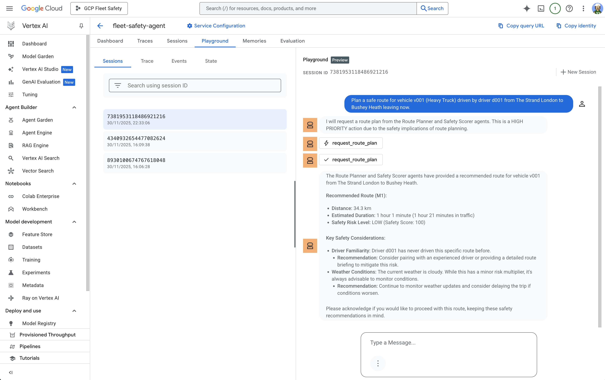

# Fleet Safety Intelligence Platform

## Problem Statement

If we ever expect autonomous fleets to be safe, our routing systems need to evolve. This project is my attempt at that problem.

A single incident can cost fleets **tens of thousands** once you factor in downtime and indirect costs, yet most routing tools still optimise for ETA and ignore:

- **Accident density** — historical hotspots and collision patterns
- **Speed-limit volatility** — variable limits, school zones, construction
- **Fatigue signals** — driver hours, break compliance, alertness patterns
- **Live incidents** — real-time traffic events and hazards
- **EV range behaviour** — battery degradation, cold weather impact, charging availability

The problem is multidimensional. Traditional routing optimises a single objective (fastest route). Fleet safety requires reasoning across multiple dimensions simultaneously—and adapting as conditions change.

**Why This Matters:** It can save lives, not just money.

---

## The Case for Agents

Traditional software struggles because **fleet safety requires continuous reasoning across multiple dimensions simultaneously**. I chose an agent-based architecture for specific technical reasons:

### 1. **Multiple Specialised Intelligences**

Fleet safety involves five interconnected problems:

- Route generation (sequential reasoning)
- Safety evaluation (parallel processing)
- Real-time monitoring (continuous loops)
- Executive insights (batch aggregation)
- Overall coordination (context-aware decision making)

A monolithic system would struggle with these competing concerns. Specialised agents excel at their specific domains.

### 2. **Dynamic Decision Making**

Conditions constantly change (traffic, weather, fatigue). Agents reason about these changes in real-time, adapting recommendations as conditions evolve.

### 3. **Tool Orchestration at Scale**

The system needs to coordinate 7+ Google Maps APIs. Agents naturally select the right tools, chain calls intelligently, and handle failures gracefully.

### 4. **Explainable Reasoning**

Agents can explain *why* a route was chosen (e.g., "Avoids high-speed section with frequent accidents"), which is critical for trust.

---

## What Was Built

### Overall Architecture

A **6-agent coordinated system** where specialised AI agents work together to prevent fleet accidents. The key architectural decision here is using ADK's `AgentTool` pattern—this means sub-agents appear as **nested invocations** in traces, so you can actually see the delegation happening.

```text
                 ┌─────────────────────────────┐
                 │  fleet_safety_orchestrator  │
                 │  (Central Coordinator)      │
                 │  Uses AgentTool to delegate │
                 └──────────┬──────────────────┘
                            │ AgentTool calls
      ┌──────────┬──────────┼──────────┬──────────┐
      │          │          │          │          │
      ▼          ▼          ▼          ▼          ▼
 ┌────────┐ ┌────────┐ ┌────────┐ ┌────────┐ ┌────────┐
 │ route_ │ │safety_ │ │rerouter│ │ risk_  │ │analy-  │
 │planner_│ │scorer_ │ │_agent  │ │monitor_│ │ tics_  │
 │ agent  │ │ agent  │ │        │ │ agent  │ │ agent  │
 └───┬────┘ └───┬────┘ └───┬────┘ └───┬────┘ └───┬────┘
     │          │          │          │          │
     └──────────┴──────────┴──────────┴──────────┘
                        │
                        ▼
           ┌────────────────────────┐
           │ Google Maps MCP Server │
           │  (11 Tools)            │
           │                        │
           │  • get_directions      │
           │  • calculate_route_    │
           │    safety_factors      │
           │  • search_places       │
           │  • get_traffic_        │
           │    conditions          │
           │  • snap_to_roads       │
           │  • geocode_address     │
           │  • get_speed_limits    │
           │  • distance_matrix     │
           │  • get_place_details   │
           │  • reverse_geocode     │
           │  • get_route_          │
           │    elevation_gain      │
           └────────────────────────┘
```

### The Agents

Each agent is a proper `LlmAgent` with its own instruction and tools. When the orchestrator calls them via `AgentTool`, they run independently with their own LLM reasoning—you'll see this as nested invocations in the trace.

#### 1. **fleet_safety_orchestrator**

- **Role**: Central coordinator—decides which specialist agents to involve
- **Pattern**: Master agent with `AgentTool` delegation
- **What it does**: Maintains fleet state, routes requests to specialists, makes final decisions, aggregates results

#### 2. **route_planner_agent**

- **Role**: Generate optimal route alternatives
- **Pattern**: Sequential workflow (validate → generate → calculate costs → rank)
- **Key capability**: Calls Google Maps MCP for real directions, handles both diesel and **EV** vehicles

#### 3. **safety_scorer_agent**

- **Role**: Evaluate route safety (0-100 score)
- **Pattern**: Parallel evaluation of multiple factors
- **Scoring covers**: Speed limits, traffic patterns, route complexity, historical accident data, weather, driver experience
- **EV-specific**: Accounts for range risks in cold weather

#### 4. **rerouter_agent**

- **Role**: Monitor active trips, trigger rerouting when needed
- **Pattern**: Event-driven (responds to incidents)
- **Triggers**: Traffic delays >15 min, road closures, weather hazards, **EV critical low battery**

#### 5. **risk_monitor_agent**

- **Role**: Real-time telemetry monitoring
- **Pattern**: Continuous monitoring
- **Detects**: Harsh braking, speeding, driver fatigue patterns

#### 6. **analytics_agent**

- **Role**: Historical analysis and predictions
- **Pattern**: Batch processing for reporting
- **Capabilities**: Trend analysis, driver scoring, predictive risk modelling, **energy efficiency tracking** (kWh/mile for EVs)

### Google Maps MCP Server

This project uses my custom **[Google Maps MCP Server](https://github.com/ettysekhon/google-maps-mcp-server)** — a production-ready Model Context Protocol server for Google Maps Platform APIs.

[](https://pypi.org/project/google-maps-mcp-server/)
[](https://pypi.org/project/google-maps-mcp-server/)
[](https://opensource.org/licenses/Apache-2.0)

**Key Features:**

- **11 Tools** spanning Places, Directions, Geocoding, Distance Matrix, Roads, and Elevation APIs
- **Production-Ready**: Robust error handling, automatic retries with exponential backoff
- **Universal Integration**: Works with Claude Desktop, Google ADK, and any MCP-compatible client
- **Type-Safe**: Full type annotations with Pydantic validation

**Available Tools:**

| Tool | Description |
|------|-------------|
| `search_places` | Find points of interest near a location |
| `get_place_details` | Get comprehensive details for a place |
| `get_directions` | Get routes with real-time traffic |
| `get_traffic_conditions` | Analyse real-time traffic congestion |
| `geocode_address` | Convert addresses to coordinates |
| `reverse_geocode` | Convert coordinates to addresses |
| `calculate_distance_matrix` | Multi-origin/destination distances |
| `snap_to_roads` | Snap GPS points to road network |
| `get_speed_limits` | Retrieve speed limit data |
| `get_route_elevation_gain` | Calculate elevation gain and profile |
| `calculate_route_safety_factors` | Assess route safety risks (compound tool) |

**Installation:**

```bash
uv pip install google-maps-mcp-server
```

See the [full documentation](https://github.com/ettysekhon/google-maps-mcp-server) for setup and usage.

### Key Technical Features

- **Proper multi-agent delegation**: Uses ADK's `AgentTool` pattern—sub-agents appear as nested invocations in traces
- **6 specialist agents**: Each with distinct responsibilities and their own LLM reasoning
- **EV & diesel fleet support**: Handles charging stops, range anxiety, energy costs
- **Live weather integration**: Open-Meteo API data feeds into safety scoring
- **Custom MCP server**: 11 tools across 7 Google Maps APIs
- **Async throughout**: Proper `async/await` patterns for production use

---

## Showcase & Demo (ADK Web UI)

The ADK Web UI is where you'll spend most of your time during development. It shows you exactly what's happening: which agents are being called, what they're thinking, and how long each step takes.

**[Read the Showcase Guide](SHOWCASE_GUIDE.md)** for demo prompts and what to look for.

### Screenshots

#### Agent Response with Safety Recommendations

The orchestrator delegates to `route_planner_agent` and `risk_monitor_agent`, then aggregates their findings:


#### Trace View with Nested Agent Invocations

This is the key bit—you can see sub-agents appearing as **nested invocations**, not just function calls. Each agent runs its own LLM:


#### Event Details with Tool Calls

Expand any step to see exactly what parameters were passed and what came back:


#### Request Inspection

Useful for debugging—see the system instructions and available tools the LLM sees:


#### Agent Architecture Graph

Visual overview of the orchestrator and its tools (including the `AgentTool` wrappers for sub-agents):


#### Cloud Deployment (Vertex AI Agent Engine)

Production deployment to Agent Engine, with the MCP server running separately on GKE:



## Quick Start

Get up and running in 5 minutes.

### 1. Clone and Install

```bash
git clone https://github.com/ettysekhon/adk-fleet-safety-multi-agent-system.git
cd adk-fleet-safety-multi-agent-system
make install
```

### 2. Set Up Environment

```bash
cp .env_example .env
# Edit .env with your API keys (see below)
```

### 3. Run Locally

```bash
make playground
# Open http://localhost:8000
```

### Environment Variables

| Key | Purpose | Required? |
|-----|---------|-----------|
| `GOOGLE_API_KEY` | Gemini LLM for agent reasoning | Yes (local dev) |
| `MCP_SERVER_URL` | Remote MCP server URL | Recommended |
| `GOOGLE_MAPS_API_KEY` | Local MCP server | Only if no `MCP_SERVER_URL` |

**Minimal `.env` for quick start:**

```bash
GOOGLE_API_KEY=your-gemini-api-key
MCP_SERVER_URL=http://XX.XX.X.XXX/sse
```

> **Tip**: Using `MCP_SERVER_URL` means you don't need your own Google Maps API key.

---

## Running Locally

### Option 1: ADK Web UI

The Web UI provides visual traces, tool call logs, and conversation history.

```bash
make playground
```

Open <http://localhost:8000> in your browser.

### Option 2: CLI Demo

Run the interactive command-line demo:

```bash
make demo
```

### Option 3: Quick Validation

Run the agent module directly:

```bash
make run
```

---

## Deploying to Google Cloud

See [DEPLOYMENT.md](DEPLOYMENT.md).

### Step-by-Step Deployment Guide

Follow these steps to deploy the Fleet Safety Agent to your own GCP project.

#### Step 1: Prerequisites

Ensure you have:

- **Google Cloud account** with billing enabled
- **gcloud CLI** installed ([install guide](https://cloud.google.com/sdk/docs/install))
- **Python 3.12** and **uv** package manager

#### Step 2: Authenticate with GCP

```bash
# Login to Google Cloud
gcloud auth login

# Set your project
gcloud config set project YOUR_PROJECT_ID

# Enable required APIs
gcloud services enable aiplatform.googleapis.com storage.googleapis.com
```

#### Step 3: Set Up Environment Variables

```bash
# Copy the example file
cp .env_example .env

# Edit .env with your values
```

Your `.env` file should contain:

```bash
# Required for local development (Gemini LLM)
GOOGLE_API_KEY=your-gemini-api-key

# For MCP Server - choose ONE:
# Option A: Use remote MCP server (recommended)
MCP_SERVER_URL=http://XX.XX.X.XXX/sse

# Option B: Use local MCP server (requires your own Maps API key)
# GOOGLE_MAPS_API_KEY=your-maps-api-key
```

> **Note**: `GOOGLE_API_KEY` is automatically filtered out during deployment. Agent Engine uses service account authentication instead.

#### Step 4: Install Dependencies

```bash
make install
```

#### Step 5: Deploy

```bash
make deploy
```

Or run the deploy script directly with custom options:

```bash
uv run python app/app_utils/deploy.py \
  --display-name="fleet-safety-agent" \
  --description="Fleet Safety Multi-Agent System" \
  --env-file=.env
```

This will:

1. Package your agent code
2. Upload to a GCS staging bucket (auto-created)
3. Deploy to Vertex AI Agent Engine
4. Generate `deployment_metadata.json` with your Agent Engine ID

**Expected output:**

```text
Deployment successful!
Service Account: service-XXX@gcp-sa-aiplatform-re.iam.gserviceaccount.com

Open Console Playground: https://console.cloud.google.com/vertex-ai/agents/...
```

#### Step 6: Test Your Deployment

```bash
# Interactive mode
uv run python scripts/query_deployed_agent.py

# Single query
uv run python scripts/query_deployed_agent.py --query "What is the fleet status?"
```

### CI/CD with GitHub Actions

The repo includes two workflows:

| Workflow | Trigger | What it does |
|----------|---------|--------------|
| `ci.yml` | PR + push to main | Lint + unit tests |
| `deploy.yml` | Push to main | Tests + deploy to Agent Engine |

#### GitHub Secrets Required

Add these to your repo settings (Settings → Secrets → Actions):

| Secret | Description | Example |
|--------|-------------|---------|
| `GCP_PROJECT_ID` | Your GCP project ID | `my-project-123` |
| `GCP_WORKLOAD_IDENTITY_PROVIDER` | WIF provider path | `projects/123/locations/global/workloadIdentityPools/github-pool/providers/github-provider` |
| `GCP_SERVICE_ACCOUNT` | Service account email | `github-actions-sa@my-project.iam.gserviceaccount.com` |
| `MCP_SERVER_URL` | Remote MCP server endpoint | `http://XX.XX.X.XXX/sse` |

#### Setting Up Workload Identity Federation

If you don't have WIF configured, run these commands once:

```bash
# Variables
PROJECT_ID=your-project-id
PROJECT_NUMBER=$(gcloud projects describe $PROJECT_ID --format='value(projectNumber)')
POOL_NAME=github-pool
PROVIDER_NAME=github-provider
SA_NAME=github-actions-sa

# Create workload identity pool
gcloud iam workload-identity-pools create $POOL_NAME \
  --location="global" \
  --project=$PROJECT_ID

# Create OIDC provider for GitHub
gcloud iam workload-identity-pools providers create-oidc $PROVIDER_NAME \
  --location="global" \
  --workload-identity-pool=$POOL_NAME \
  --issuer-uri="https://token.actions.githubusercontent.com" \
  --attribute-mapping="google.subject=assertion.sub,attribute.repository_owner=assertion.repository_owner" \
  --attribute-condition="assertion.repository_owner == 'YOUR_GITHUB_USERNAME'" \
  --project=$PROJECT_ID

# Create service account
gcloud iam service-accounts create $SA_NAME \
  --display-name="GitHub Actions" \
  --project=$PROJECT_ID

# Grant required roles
gcloud projects add-iam-policy-binding $PROJECT_ID \
  --member="serviceAccount:$SA_NAME@$PROJECT_ID.iam.gserviceaccount.com" \
  --role="roles/aiplatform.admin"

gcloud projects add-iam-policy-binding $PROJECT_ID \
  --member="serviceAccount:$SA_NAME@$PROJECT_ID.iam.gserviceaccount.com" \
  --role="roles/storage.admin"

# Allow GitHub to impersonate the service account
gcloud iam service-accounts add-iam-policy-binding \
  $SA_NAME@$PROJECT_ID.iam.gserviceaccount.com \
  --role="roles/iam.workloadIdentityUser" \
  --member="principalSet://iam.googleapis.com/projects/$PROJECT_NUMBER/locations/global/workloadIdentityPools/$POOL_NAME/attribute.repository_owner/YOUR_GITHUB_USERNAME" \
  --project=$PROJECT_ID

# Print the provider path (use this for GCP_WORKLOAD_IDENTITY_PROVIDER secret)
echo "projects/$PROJECT_NUMBER/locations/global/workloadIdentityPools/$POOL_NAME/providers/$PROVIDER_NAME"
```

Replace `YOUR_GITHUB_USERNAME` with your GitHub username or org (e.g., `ettysekhon`).

### What Gets Deployed

| Component | Description |
|-----------|-------------|
| Agent code | Packaged and uploaded to GCS |
| Environment vars | From `.env` (excluding `GOOGLE_API_KEY`) |
| Auto-scaling | 1-10 instances |
| Resources | 4 CPU, 8Gi memory per instance |

### Files Generated

| File | Purpose |
|------|---------|
| `deployment_metadata.json` | Contains your Agent Engine ID (auto-generated, gitignored) |

### Troubleshooting Deployment

**"Permission denied" errors:**

```bash
# Ensure you're authenticated
gcloud auth login
gcloud auth application-default login
```

**"API not enabled" errors:**

```bash
gcloud services enable aiplatform.googleapis.com storage.googleapis.com
```

**Deployment takes too long (>10 mins):**

- First deployment can take 5-10 minutes
- Check Cloud Build logs in GCP Console

### MCP Server Architecture

Locally, the agent spawns the MCP server as a subprocess (stdio). In production, Agent Engine blocks subprocess spawning, so the MCP server is deployed separately to GKE with SSE transport:

```text
┌─────────────────────────────────────────────────────────────────────┐
│  Vertex AI Agent Engine                                             │
│  ┌─────────────────────┐                                            │
│  │  ADK Agent          │                                            │
│  └─────────────────────┘                                            │
└───────────│─────────────────────────────────────────────────────────┘
            │ HTTP/SSE
            ▼
┌─────────────────────────────────────────────────────────────────────┐
│  GKE (Google Kubernetes Engine)                                     │
│  ┌─────────────────────┐                                            │
│  │  MCP Server         │  ← http://<your-gke-ip>/sse                │
│  │  (SSE Transport)    │                                            │
│  └─────────────────────┘                                            │
└─────────────────────────────────────────────────────────────────────┘
```

#### Option 1: GKE Deployment (Recommended)

The MCP server is deployed to GKE and accessible via SSE:

```bash
# Set the remote MCP server URL
export MCP_SERVER_URL=http://XX.XX.X.XXX/sse

# Test the connection
curl http://XX.XX.X.XXX/health
# Expected: {"status":"healthy","version":"0.2.1","service":"google-maps-mcp-server"}

# Run locally with remote MCP
make playground
```

#### Option 2: Cloud Run Deployment

```bash
gcloud run deploy google-maps-mcp-server \
    --source . \
    --set-env-vars="GOOGLE_MAPS_API_KEY=your-key" \
    --allow-unauthenticated
```

**Environment Variables:**

| Variable | Description | Required |
|----------|-------------|----------|
| `MCP_SERVER_URL` | Remote MCP server SSE endpoint (e.g., `http://XX.XX.X.XXX/sse`) | For production |
| `GOOGLE_MAPS_API_KEY` | Google Maps API key | For local stdio only |

When `MCP_SERVER_URL` is set, the agent connects via SSE. Otherwise, it falls back to local subprocess (stdio) for development

---

## Project Structure

Here's how the codebase is organised. The key files to understand first are highlighted:

```bash
├── app/
│   ├── agents/fleet_safety/      # START HERE - the actual agents
│   │   ├── agent.py              # Entry point - creates & wires up all agents
│   │   ├── orchestrator.py       # Central coordinator with AgentTool wrappers
│   │   ├── route_planner_agent.py
│   │   ├── safety_scorer_agent.py
│   │   ├── dynamic_rerouter_agent.py
│   │   ├── risk_monitor_agent.py
│   │   ├── analytics_agent.py
│   │   └── evaluation/           # ADK evaluation configs
│   ├── agent.py                  # Root entry point (imports from agents/fleet_safety/)
│   ├── agent_engine_app.py       # Production wrapper for Vertex AI deployment
│   ├── app_utils/
│   │   ├── deploy.py             # Agent Engine deployment script
│   │   ├── requirements-deploy.txt  # Production dependencies
│   │   ├── telemetry.py          # OpenTelemetry setup
│   │   └── types.py              # Pydantic models
│   └── helpers/
│       ├── env.py                # Environment variable loading
│       └── weather.py            # Open-Meteo weather integration
├── scripts/
│   └── query_deployed_agent.py   # CLI for testing deployed agents
├── tests/
│   ├── unit/                     # No API keys needed - uses mocks
│   ├── integration/              # Needs MCP server running
│   └── load_test/                # Locust load testing
├── docs/
│   ├── screenshots/              # UI screenshots
│   └── ai_course/                # Kaggle course materials
├── .github/workflows/
│   ├── ci.yml                    # Lint + unit tests on PR
│   └── deploy.yml                # Deploy to Agent Engine on push to main
├── Makefile                      # Common commands - run `make help`
├── SHOWCASE_GUIDE.md             # Demo prompts and what to look for
├── DEPLOYMENT.md                 # Agent Engine vs GKE - architecture deep dive
└── deployment_metadata.json      # Auto-generated after deployment (gitignored)
```

**Where to start:**

1. Read `app/agents/fleet_safety/agent.py` — see how agents are created and wired together
2. Read `orchestrator.py` — see how `AgentTool` wraps specialist agents
3. Run `make playground` and try the prompts from `SHOWCASE_GUIDE.md`

### Scenario 1: Intelligent Route Planning (Diesel)

**Setup**: Route HGV from London to Manchester.

**What you'll see in the trace**:

1. `fleet_safety_orchestrator` receives the request
2. Nested `route_planner_agent` invocation—generates route alternatives
3. Nested `safety_scorer_agent` invocation—evaluates each route
4. Orchestrator aggregates and recommends the safest option

### Scenario 2: Electric Vehicle Routing

**Setup**: Electric Van from Cambridge to Edinburgh (180-mile range vs 300-mile trip).

**What's different for EVs**:

1. `route_planner_agent` identifies range constraints
2. **Automatically adds charging stops** at optimal midpoints
3. Calculates **charging time** (45 mins fast charge) and **energy cost** (£0.45/kWh)
4. `safety_scorer_agent` flags cold weather risks affecting battery range

### Scenario 3: Real-Time Rerouting

**Setup**: Traffic incident on M25.

**What you'll see**:

1. `rerouter_agent` detects >15 min delay
2. May chain to `route_planner_agent` for alternatives
3. Evaluates safety/time tradeoff before recommending

### Scenario 4: Executive Dashboard

**Setup**: End-of-day review.

**What you'll see**:

1. Orchestrator's `generate_executive_dashboard` tool called
2. `analytics_agent` invocation for historical data
3. Dashboard includes **energy efficiency** metrics for EVs

---

## The Build

### Technology Stack

- **Core**: Google ADK, Gemini 2.5 Flash, Python 3.12, asyncio
- **APIs**: Google Maps Platform (7 APIs via MCP)
- **Tools**: MCP Protocol, polyline, uv package manager

### Key Architectural Decisions

These are worth understanding if you're building something similar:

#### 1. Custom MCP Server (vs Direct API Calls)

We built a custom MCP server rather than having agents call Google Maps APIs directly.

**Why this matters**: The MCP server provides a clean abstraction. Agents just call tools like `get_directions`—they don't need to know about API authentication, rate limiting, or response parsing. It also lets us create compound tools like `calculate_route_safety_factors` that orchestrate multiple API calls.

#### 2. `AgentTool` Pattern (vs Direct Method Calls)

Sub-agents are wrapped in `AgentTool` rather than called as Python methods.

**Why this matters**: With `AgentTool`, each sub-agent runs its own LLM and appears as a nested invocation in traces. Without it, you'd just see a function call—no visibility into what the sub-agent was "thinking". This is crucial for debugging and understanding agent behaviour.

#### 3. Single Orchestrator (vs Peer-to-Peer)

One central orchestrator coordinates all specialists, rather than agents talking directly to each other.

**Why this matters**: Fleet operations often have conflicting priorities (safety vs speed vs cost). A central orchestrator can make those tradeoffs explicitly. It also makes the system easier to reason about—there's one place where the "final decision" happens.

---

## Future Enhancements

### Immediate (PRs Welcome)

1. **Production database**: Replace synthetic data with real fleet DB (PostgreSQL/BigQuery)
2. **More eval scenarios**: The current eval suite is basic—add edge cases
3. **Better error handling**: Some MCP failures could be handled more gracefully

### Medium-Term

1. **Driver personalisation**: Route preferences based on individual safety records
2. **Predictive maintenance integration**: Factor vehicle health into routing decisions

### Long-Term

1. **Computer vision**: Dashcam agent for real-time hazard detection
2. **ML models**: Train incident prediction on actual fleet data
3. **V2V communication**: Vehicle-to-vehicle coordination for platooning

---

## Troubleshooting

### "Tool 'calculate_route_safety_factors' not listed"

The MCP server package is out of date. Update it:

```bash
uv lock --upgrade-package google-maps-mcp-server
uv sync
```

### "Only one agent invoked"

The LLM decides which agents to call. Be explicit in your prompt:

- ❌ "Plan a route from A to B"
- ✅ "Plan a route from A to B and **evaluate the safety** of each option"

### "Sub-agent not showing as nested invocation"

Check `orchestrator.py` uses `AgentTool`:

```python
AgentTool(agent=self.route_planner, skip_summarization=True)
```

If it's calling methods directly (e.g., `await self.route_planner.generate_route_options(...)`), you won't see nested invocations.

### "MCP connection failed"

Either set `MCP_SERVER_URL` for remote, or set `GOOGLE_MAPS_API_KEY` for local. The agent tries remote first, then falls back to local.

---

## Testing & Evaluation

Two layers of testing here: **Code Layer** (does the code work?) and **Cognition Layer** (does the agent make sensible decisions?).

### Quick Reference

| Command | What it tests | Needs API keys? |
|---------|---------------|-----------------|
| `make test-unit` | Agent logic with mocks | No |
| `make test-integration` | Real MCP server calls | Yes (Maps) |
| `make eval` | Agent reasoning quality | Yes (Gemini) |
| `./run_evals.sh` | Everything | Yes (both) |

### 1. Unit Tests (Start Here)

These use **mock MCP clients**—no API keys, no network. Perfect for CI/CD and quick feedback during development.

```bash
make test-unit

# Or run specific tests
uv run pytest tests/unit/test_route_planner.py -v
uv run pytest tests/unit/test_safety_scorer.py -v
```

### 2. Integration Tests

These hit the **real Google Maps MCP server**. You'll need either:

- `MCP_SERVER_URL` set (connects to remote server), or
- `GOOGLE_MAPS_API_KEY` set (spawns local MCP subprocess)

```bash
# Remote MCP (recommended - no local setup needed)
export MCP_SERVER_URL=http://XX.XX.X.XXX/sse
make test-integration

# Or local MCP
export GOOGLE_MAPS_API_KEY=your-maps-api-key
make test-integration
```

### 3. ADK Evaluations (Agent Reasoning)

This is the interesting bit—it tests whether the agent makes **sensible decisions**, not just whether the code runs. ADK sends test prompts and scores the responses.

```bash
make eval
```

The eval config lives in `app/agents/fleet_safety/evaluation/`. Have a look at the `.evalset.json` files to see what scenarios are tested.

### 4. Full Suite

Run everything in one go:

```bash
./run_evals.sh
```

---

## Learning Resources

This project was built as a capstone for the **[Kaggle 5-Day AI Agents Intensive Course](https://www.kaggle.com/competitions/agents-intensive-capstone-project)** with Google.

### Google Whitepapers

The course includes five excellent whitepapers on agentic AI—well worth reading end to end:

| # | Whitepaper | Topics |
|---|------------|--------|
| 1 | [Introduction to Agents](docs/ai_course/google_whitepapers/1_Introduction%20to%20Agents.pdf) | Agent fundamentals, reasoning patterns, orchestration |
| 2 | [Agent Tools & MCP](docs/ai_course/google_whitepapers/2_Agent%20Tools%20%26%20Interoperability%20with%20Model%20Context%20Protocol%20%28MCP%29.pdf) | Tool design, MCP protocol, security considerations |
| 3 | [Context Engineering: Sessions & Memory](docs/ai_course/google_whitepapers/3_Context%20Engineering_%20Sessions%20%26%20Memory.pdf) | Session management, context compaction, long-term memory |
| 4 | [Agent Quality](docs/ai_course/google_whitepapers/4_Agent%20Quality.pdf) | Evaluation frameworks, metrics, testing strategies |
| 5 | [Prototype to Production](docs/ai_course/google_whitepapers/5_Prototype%20to%20Production.pdf) | Deployment, AgentOps, CI/CD, observability |

### Course Materials

See [`docs/ai_course/README.md`](docs/ai_course/README.md) for the full course breakdown, Kaggle notebook links, and example scripts covering all five days.
